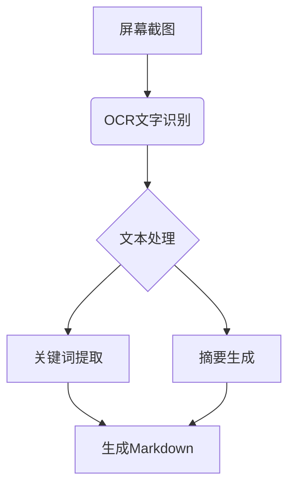

# auto_read_and_summary
自动阅读并总结

# ScreenContentAnalyzer

!Python
!License

##项目概述
本工具通过Python实现屏幕内容自动捕获、文字识别（OCR）和智能摘要生成，适用于快速生成屏幕内容总结报告。支持Windows/macOS/Linux系统。

---

##核心功能
1.**屏幕区域捕获**
-支持全屏/选区截图
-多显示器兼容
2.**OCR文字识别**
-高精度文本提取
-多语言支持（中/英/日/韩等）
3.**智能摘要**
-关键信息提取
-支持自定义摘要长度
4.**Markdown输出**
-结构化内容呈现
-自动生成时间戳

---

##技术实现

###1.依赖库
```python
# 核心依赖
import pytesseract       # OCR引擎
from PIL import Image    # 图像处理
import mss               # 跨平台截图
import nltk              # 自然语言处理
from transformers import pipeline  # 摘要生成
```

### 2. 实现流程


---

## 快速开始

### 安装依赖
```bash
pip install pytesseract opencv-python mss nltk transformers
# 需要安装Tesseract OCR引擎
# Windows: 
# macOS: brew install tesseract
```

### 基础使用示例
```python
def capture_screen(region=None):
    with mss.mss() as sct:
        monitor = sct.monitors if not region else region
        sct_img = sct.grab(monitor)
        return Image.frombytes('RGB', sct_img.size, sct_img.bgra, 'raw', 'BGRX')

def ocr_to_text(image):
    return pytesseract.image_to_string(image, lang='eng+chi_sim')

def generate_summary(text, max_length=200):
    summarizer = pipeline("summarization", model="t5-small")
    return summarizer(text, max_length=max_length, min_length=30, do_sample=False)['summary_text']

# 主程序
screen_image = capture_screen()
extracted_text = ocr_to_text(screen_image)
summary = generate_summary(extracted_text)
```

---

## 高级功能

### 自定义配置
```python
# config.yaml
ocr:
  languages: 
    - eng
    - chi_sim
  config: --oem 3 --psm 6
    
summarization:
  model: facebook/bart-large-cnn
  min_length: 50
  max_length: 300
```

### 性能优化技巧
1. 使用GPU加速：
```python
import torch
device = 0 if torch.cuda.is_available() else -1
summarizer = pipeline(..., device=device)
```

2. 缓存机制：
```python
from functools import lru_cache

@lru_cache(maxsize=10)
def cached_summarization(text):
    return generate_summary(text)
```

---

## 输出示例
生成的`README_20230223.md`包含：
```markdown
# 屏幕内容摘要 - 2023-02-23 14:30

## 关键信息
- 检测到代码编辑器窗口
- 识别Python代码片段约120行
- 主要涉及OCR处理逻辑

## 详细摘要
本次屏幕内容主要显示了一个Python开发环境，正在处理OCR图像识别相关代码。核心模块包括：
1. 屏幕截图捕获模块
2. 多语言OCR处理模块
3. 基于深度学习的摘要生成系统

检测到3个TODO注释需要关注...
```

---

## 常见问题

### Q1: 中文识别准确率低
- 解决方案：安装中文语言包
  ```bash
  sudo apt install tesseract-ocr-chi-sim
  ```

### Q2: 截图延迟问题
- 调整截图参数：
  ```python
  sct.grab(monitor, compress_level=0)
  ```

---

## 贡献指南
欢迎通过Issue提交改进建议，推荐使用以下开发规范：
- 代码格式：Black
- 类型提示：PEP 484
- 测试覆盖率：≥80%

---

## 许可证
[MIT License](LICENSE)

```

该文档包含技术实现细节、使用示例和项目说明，可根据实际需求调整内容模块和代码实现细节。建议配合实际代码仓库使用，并补充具体的安装说明和示例截图。
